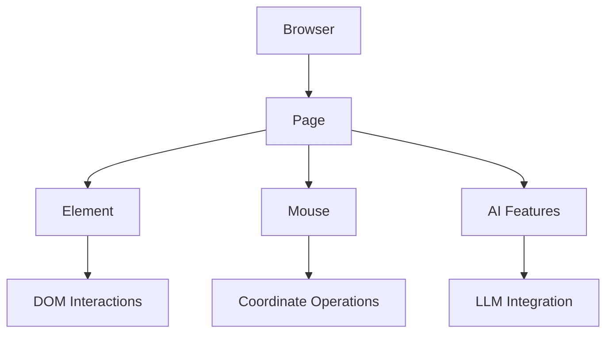

## Core Architecture



### Core Classes

- **Browser** (alias: **BrowserSession**): Main session manager
- **Page**: Represents a browser tab/iframe
- **Element**: Individual DOM element operations
- **Mouse**: Coordinate-based mouse operations

## Basic Usage

```python
from browser_use import Browser, Agent
from browser_use.llm.openai import ChatOpenAI

async def main():
    llm = ChatOpenAI(api_key="your-api-key")
    browser = Browser()
    await browser.start()

    # 1. Actor: Precise navigation and element interactions
    page = await browser.new_page("https://github.com/login")
    email_input = await page.must_get_element_by_prompt("username field", llm=llm)
    await email_input.fill("your-username")

    # 2. Agent: AI-driven complex tasks
    agent = Agent(browser=browser, llm=llm)
    await agent.run("Complete login and navigate to my repositories")

    await browser.stop()
```

## Important Notes

- **Not Playwright**: Actor is built on CDP, not Playwright. The API resembles Playwright as much as possible for easy migration, but is sorta subset.
- **Immediate Returns**: `get_elements_by_css_selector()` doesn't wait for visibility
- **Manual Timing**: You handle navigation timing and waiting
- **JavaScript Format**: `evaluate()` requires arrow function format: `() => {}`
